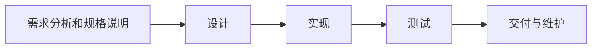
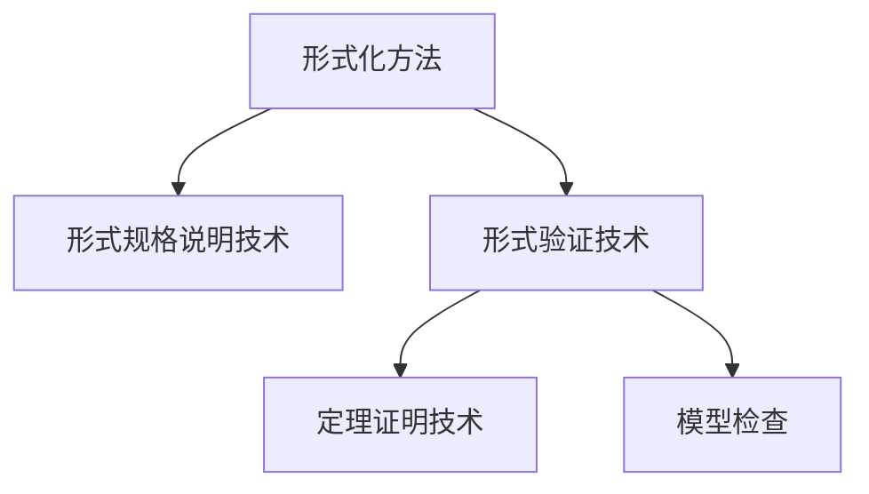

# 软件形式规格说明语言-Z

## 第1章 绪论

### 1.1 软件生命周期

软件：

1. 当它被执行时提供希望功能和性能的指令

2. 使得程序能够适当地操作信息的数据

3. 描述程序的操作和使用文档

**软件=程序+数据+文档**

软件开发周期（软件生命周期)

1. **需求分析和规格说明**

   对提出的需求进行分析并给出详细的定义。

2. **设计**

   完成需求的收集和分析工作后，就开始系统的设计工作，详细地确定将如何构造系统来实现所需的功能。

   关注数据要求（在系统中将处理何种信息）、软件构架（应用系统将如何构造）以及界面架构（系统外表特征将是什么样的、遵循什么样的标准）

   *抽象设计：*

   ​	    构造定义了软件模块或者是部件之间关系的整个系统的体系结构。

   *详细设计：*

   ​        关注数据结构定义以及算法构造。

3. **实现**

   将设计规格说明转换成用特定的编程语言。

4. **测试**

   通过运行测试用例来检测程序中可能存在的故障。

   测试包括以下三个步骤：

   1. 产生测试用例
   2. 用测试用例来运行程序
   3. 测试结果分析

   两种方法进行程序测试：

   1. *功能测试*

      发现导致违反规格说明与程序之间一致性的故障，且测试用例通常是基于功能规格说明产生的。

   2. *结构测试*

      按照程序内部逻辑测试程序，检验程序中每一条路径是否能按照规定的要求正确工作。

5. **交付与维护**

   这个阶段是指系统最终交付给客户运行。

### 1.2 存在的问题

- 需求错误通常比其他错误多花费10倍时间来修复

- 需求错误通常占软件项目总错误的40%以上

- 需求错误的稍微减少能显著地降低返工成本和日程延期

由上述可以得出结论：

- 需求错误是最常见的错误

- 修正需求错误的代价是最为昂贵的

- 解决“软件危机”的最有前途的方法应该是那些对软件需求的解决方案上

### 1.3 形式方法

软件规格说明需要的是一种既有精确性又有抽象性的描述语言。

两种抽象：

1. *过程抽象*

   描述软件系统要实现的功能，而非如何实现其功能的具体步骤。

2. *数据抽象*

   在规格说明中使用集合、关系、映射、序列、包等抽象的数学结构，而不必担心如何实现。

**形式方法**：通过形式化、规范化的数学理论，用描述“做什么”来取代“怎么做”。

**基本思想**：对系统建立一个数学模型，研究和提供一种基于数学的或形式语义学的规格说明语言，用这种语言严格地描述所开发的软件功能，并由自动程序设计的加工模型来得到可执行的代码。

**软件开发的形式方法**是一种提供了描述软件产品，如规格说明、设计和源代码的形式语言，并支持对描述产品的性质进行推理和验证的方法。

**形式验证**：基于已建立的形式规格说明的基础上，对所描述系统的相关性质进行分析和验证以评判系统是否满足期望的性质。

形式验证技术包括定理和模型检查。

1. *定理证明技术*

   形式方法的核心。实质是从公理应用推理规则则推出相关性质成立的过程。

   使用定理证明技术，可以对用户期望的或系统应具有的性质进行证明，以消除规格说明中的模糊性、不一致性、不安全性等。

2. *模型检查*

   一种自动验证系统正确性的方法。

**形式规格说明语言的分类**

1. *基于模型的方法*

   也称基于状态的形式方法。

   基本思想：利用一些已知特性的数学抽象来为目标软件系统的状态特征和行为特征构造模型。（数学抽象包括域、元组、集合、序列、包、映射等）

2. *代数方法*

   仅使用带有等词的一阶逻辑的表示，而不引入通常的数学对象。

3. *进程代数方法*

   采用代数方法对并行或分布式系统进行研究的方法。

   提供了描述并发系统所需的并行复合、选择、顺序复合等语句，并可通过等式推理的方法来验证系统满足某些性质。

**形式规格说明语言的优缺点**

- 优点

  - 形式规格说明是精确的
  - 由误解引起的错误减少
  - 形式规格说明利于系统实现
  - 能够对形式规格说明进行正确性证明

- 缺点

  - 形式规格说明难以阅读

  - 形式方法并不能对客观世界的所有方面进行模型化

  - 形式规格说明的正确性证明费时费力

  - 尚未出现支持形式方法全过程的软件环境
## 第2章 一阶逻辑与集合论

### 2.1 命题逻辑

**命题与逻辑词**

命题P为真，真值为T；为假，真值为F。

能连接一些命题构成新命题的逻辑连接词：

1. 否定

   ﹁P

   ﹁P的真值为T当且仅当P的真值为F。

2. 析取

   P或者Q

   P∨Q

   P∨Q真值为T当且仅当P、Q的真值至少有一个真值为T

3. 合取

   P并且Q

   P∧Q

   P∧Q的真值为T当且仅当P、Q的真值同时为T

4. 蕴涵

   如果P为真则Q为真

   P⇒Q

   P⇒Q真值为F当且仅当P的真值为T且Q的真值为F

5. 等价

   P当且仅当Q

   P⇔Q

   P⇔Q真值为T当且仅当P、Q或者同时为T或者同时为F

**命题公式与真值表**

命题公式：

1. 原子（命题变元，也称为原子）是命题公式
2. 若P、Q是公式，则（﹁P）、(P∨Q)、(P∧Q)、(P⇒Q)、(P⇔Q)都是命题公式
3. 命题公式仅通过有限次使用（1）、（2）获得
4. 为了减少圆括号数量，约定最外层的圆括号可以省略

连接词运算的优先级为：﹁、∧、∨、⇒、⇔

### 2.2 谓词逻辑

带有参数的命题成为谓词。

**量词**

全称量词：对任意x 在谓词逻辑中记作∀x

存在量词：存在一个x在谓词逻辑中记作∃x

x是一个变量，称为约束变量。

**约束变量与自由变量**

在公式A中约束出现的是约束变量；自由出现的是自由变量。

一个变量既可以是约束变量也可以是自由变量。

x⧹p表示变量x在p中不是自由的。

### 2.3 一阶逻辑中的证明

形如T⊢A的符号相继式，其中T是一阶逻辑中的公式集合，**⊢**称为**推出**符号，读作“T推出A"或者"A由T推出"。通常称集合T为前提，而A为结论。经过证明的相继式称为定理。

**命题逻辑中的定律**（书P19-21）

∀x:T⦁p表示对集合T中的任何元素x，性质p为真。

**点规则**：若已有一个含存在量词的命题公式，其中对量词变量给定了一个确定值，则可以消去量词，用已知值来替换所出现的量词变量。

​				**∃x:S⦁(p∧x=t)⊢t∈S∧p[t∖x]**

### 2.4 集合论

**集合的表示法**

"=="是定义符号，读作“定义为”

**集合谓词**

1. 属于

   元素a是集合A中的元素

   a∈A

2. 包含

   A、B是两个集合，如果A中每一个元素都属于集合B

   A⊆B

3. 真包含

   A、B是任意两个集合，集合A中的每一个元素都属于集合B，但集合B中至少有一个元素不属于集合A，则称“集合B真包含集合A”，记作A⊂B

**空集、全集与幂集**

不含任何元素的集合称为空集，记作∅。

在一定范围内，若所有集合均为某一集合的子集，则称该集合为全集，记作E。

设A是一个集合，由A的所有子集所组成的集合，称为集合A的幂集，记作ℙA。非空幂集构造符ℙ1。

有穷集合符𝔽；非空有穷集合符𝔽1

𝔽A表示了A的所有有穷子集的集合；𝔽1A表示了A的所有非空有穷子集的集合。

**集合运算**

1. 并

   所有A或者B的元素组成的集合称为集合A、B的并集，记作A∪B

2. 交

   属于A同时又属于B的所有元素组成的集合，称为集合A、B的交集，记作A∩B

3. 差

   属于A而不属于B的所有元素组成的集合，称为A与B的差集，记作A\B

**序偶与笛卡尔积**

由两个对象x和y按一定次序排列而成的序偶，记作（x,y)，其中x是它的第一元素，y是它的第二元素。

对于自然数n，n个对象a1,a2,a3,……an，按一定次序排列称的一个n元组，记作（a1,a2,a3,……an）

设A、B是任意两个集合，若序偶的第一元素是A的第一元素，第二个元素是B的一个元素，则所有这样的序偶集合，称为“集合A、B的笛卡尔积”，记作“A×B”。即A×B=={(x,y)|x∈A，且y∈B}

## 第3章 Z的类型与构造单元

### 3.1 Z的类型系统

**基本类型**

基本类型定义是一个类型声明，引入了一个或多个基本类型。

整数类型：…-3，-2，-1,0,1,2,3…，表示为ℤ，其为内定义类型，不需再声明。

x:ℤ

**幂集类型**

若S是一个集合，则ℙS也是一个集合，称为幂集，含有集合S的所有子集。

X∈ℙℤ⇔x⊆ℤ

集合和类型的关系：

- 每一个类型是一个集合

- 当某个元素是多个集合的元素时，它只能属于一个类型

  类型是一种特定的类的集合，被看成是一个“最大集合”

**笛卡尔积**

给定任何两个集合R和S，其笛卡尔积R×S是所有这样的序偶的集合。这些序偶的第一个元素是R中的一个元素，其第二个元素是S中的一个元素。

**对象声明**

一个声明可以是x:T的形式，其中T是一个类型，或是x:S的形式，其中S是某一个类型的子集。

对于y:S的申明必须强调两点：

- 通过检查S的定义可知它的元素必须具有的类型，从而确定y的类型
- 限制了y必须满足S所定义的性质

**枚举类型**

定义一个只含有几个元素的类型，并对这几个元素给定名称。

举例：

YesNo的类型声明，该类型仅有两个值：yes和no，该类型定义可写为：YesNo::=yes|no

符号“::=“是数据类型定义符，"|"是分隔符。

### 3.2 扩充表示法

**量词化扩充表示法**

操作符“#”可得到集合中的元素个数。

性质：

- #(S∪T)=#S+#T-#(S∩T)
- 𝔽1X={S:𝔽X|#S>0}

**集合表达式扩充表达法**

声明的表中，元组的元素顺序是由声明确定的。

扩充后的集合表达式定义：{Decls|Pred⦁ExPr}

竖线“|”将声明和限制分割开，称为限制条；黑圆点“⦁”将限制与表达式分割开，整个表示以一对花括号括起。

**Z的基本库**

a到b之间（包括a和b）的所有整数的集合，就可以直接使用a..b的表示，“.."称做数域。

### 3.3 Z规格说明的构造单元

**公理定义**

**模式**

模式=声明+谓词

- 水平形式：Schema_name≙Schema_EXP

  定义符号右边是一个模式表达式。

- 垂直模式：

  

  中间的横线上面是声明部分，横线下面的是谓词部分。声明部分不能缺少，若谓词部分不出现，则默认为true。

  在垂直模式中，分号是以换行替代的。谓词P1，…，Pn之间的分号表示的是合取关系。

*“≙”是定义符号*

Z的模式的两个主要用途：

- 说明软件系统状态
- 说明状态的转化

**通用式定义**

嵌入在顶端双线中由一对方括号括起的部分是通用式参数。中线上面的声明部分声明了通用式常量，中线下面的谓词部分是限制该常量的谓词。

## 第4章 关系和函数

### 4.1 关系

**关系表示法**

关系是一个序偶的集合。

X↔Y==ℙ(X×Y)

即集合X到集合Y的任一关系是ℙ(X×Y)的一个元素。

(x,y)经常被写成"x↦y"，读作"x映射到y"

**定义域和值域**

关系的定义域是关系源集的一个子集，该子集中的任一元素至少与目标集中的一个元素有给定关系。

关系的值域是关系目标集的一个子集，对于该子集中的任一元素，在源集中都有元素与其给定的关系。

若R是一个类型为X↔Y的关系，可以用**dom**R来表示R的定义域，用**ran**R来表示R的值域。

**dom**R=={x:X|∃y:Y⦁x↦y∈R}

**ran**R=={y:Y|∃x:X⦁x↦y∈R}

### 4.2 关系运算

**关系复合**

给定两个关系，如果第一个关系的值域类型与第二个关系的定义域类型相同，则可由这两个关系通过关系复合得到一个新的关系。新关系的定义域与第一个关系的定义域相同，其值域类型与第二个关系的值域类型相同。

关系复合的运算符为**⨾**

设R和S是两个已经定义的关系：R:X↔Y；S:Y↔Z

则它们的复合R⨾S可以用下述的集合来定义：{x:X;z:Z|(∃y:Y⦁(xRy∧yRz))⦁x↦z}

**恒等和闭包**

设R:X↔Y是一个关系，如果X与Y是不同类型，则称关系R是异类关系；若X与Y是相同类型，则称R是同类关系。

类型X的两个元素之间最简单的同类关系是**恒等关系**，记为**id** X。

恒等关系的一般定义：设X是任意的集合类型，**id** X=={x:X⦁x↦x}

**关系的逆**

关系逆的一般定义为：对任何类型为X↔Y的关系R，它的逆关系为：

R是集合X到集合Y的一个关系，则其逆关系是Y到X的关系。

**关系限定和限定减**

定义域限定运算符◁出现在一个集合和一个关系的中间，该集合是想要限定的关系的定义域的子集，该关系就是已经给定的要限定的关系。

对任何类型为X↔Y的关系R，设S是定义域类型X的一个集合。

S◁R=={x:X;y:Y|x∈S∧x↦y∈R}

值域限定运算符▷出现在一个关系和一个集合的中间，该关系就是要限定的关系，该集合是所限定的关系的值域的子集。

对任何给定的类型为X↔Y的关系R，设T是值域类型Y的一个集合，则有

R▷T=={x:X;y:Y|y∈T∧x↦y∈R}

定义域限定减和值域限定减的运算可以被一般描述为：

S⩤R=={x:X;y:Y|x∉S∧x↦y∈R}

R⩥T=={x:X;y:Y|y∉T∧x↦y∈R}

### 4.3 函数

函数的性质可以形式地描述为：

设R是一个类型为X↔Y的关系，则(x↦y)∈R∧(x↦z)∈R⇒y=z

**部分函数与全函数**

运用关系的性质给出部分函数的一般定义：

X⇸Y=={R:X↔Y|(∀x:X;y,z:Y⦁(x↦y)∈R∧(x⇸z)∈R⇒y=z)}

对任何集合X和Y，X到Y的部分函数是唯一地映射定义域中的元素到值域中元素的所有关系。部分函数一般称为函数。

定义域是整个源集，称为全函数。

X→Y=={f:X⇸Y|**dom** f = X}

**入射函数与满射函数**

入射函数（一对一函数）

↣来表示全入射函数，⤔来表示部分入射函数。

X⤔Y=={f:X⇸Y|(∀x1,x2:dom f⦁f(x1)=f(x2)⇒x1=x2)}

X↣Y=={f:X→Y|(∀x1,x2:dom f⦁f(x1)=f(x2)⇒x1=x2)}

↠来表示全满射函数，⤀来表示部分满射函数（值域是整个目标集）

X↠Y=={f:X→Y|**ran** f=Y}

X⤀Y=={f:X⇸Y|**ran** f=Y}

一个满射函数的定义域中的元素个数至少要和值域中的元素个数一样多。

如果一个函数既是入射函数又是满射函数，则称之为双射函数。

部分双射函数的定义：X⤗Y==(X⤔Y)∩(X↠Y)

全双射函数的定义：X⤖Y==(X⤗Y)∩(X→Y)

定义域为有穷集合的函数：有穷函数

有穷部分函数定义：X⇻Y=={f:X⇸Y|**dom** f ∈𝔽X}

有穷部分入射函数：X⤕Y==(X⇻Y)∩(X⤔Y)

| 名称             | 符号 | dom f | 一对一 | ran f |
| ---------------- | ---- | ----- | ------ | ----- |
| 全函数           | →    | = X   |        | ⊆ Y   |
| 部分函数         | ⇸    | ⊆ X   |        | ⊆ Y   |
| 全入射函数       | ↣    | = X   | √      | ⊆ Y   |
| 部分入射函数     | ⤔    | ⊆ X   | √      | ⊆ Y   |
| 全满射函数       | ↠    | = X   |        | = Y   |
| 部分满射函数     | ⤀    | ⊆ X   |        | = Y   |
| 全双射函数       | ⤖    | = X   | √      | = Y   |
| 部分双射函数     | ⤗    | ⊆ X   | √      | = Y   |
| 有穷部分函数     | ⇻    | ⊆ X   |        | ⊆ Y   |
| 有穷部分入射函数 | ⤕    | ⊆ X   | √      | ⊆ Y   |

**函数叠加操作和通用式定义**

函数叠加的形式定义可叙述为：设f和g都是类型为X⇸Y的函数，此处X是源集，Y是目标集，则f⊕g==((**dom** g)⩤f)∪g

该操作从f中删除了所有这样的序偶，其第一元素属于g的定义域，然后将函数g中新的序偶添加进去。

函数叠加操作的通用式定义：

### 第五章 模式和规格说明

### 5.1 模式的描述功能

一个模式描述了一个系统的状态。

**模式描述操作**

操作模式描述了系统某部分的行为特征，通过描述操作前该部分的状态值和操作后该部分状态值的关系，来定义系统该部分的一种操作特性。

在Z中，采用的表达方式是：输入变量的最后一个字符后跟随一个“？”，输出变量的最后一个字符后跟随一个“！”。前状态变量就是通常的变量，而对应的后状态变量是以撇号’作为右上标修饰的变量。

### 5.2 模式的修饰和包含

**模式修饰**

模式修饰提供了一种系统的方法，在一个模式中引入修饰变量并加上关于它们的不变式。

**模式包含**

模式包含的目的是为了使规格说明的长度缩短，以使我们能够比较简明而清楚地说明复杂的操作。

模式包含是指一个模式将另一个模式的名包含在其声明中。

**Δ和Ξ表示**

ΔS≙S∧S‘

**初始状态模式**

可以把一个系统的初始化看成是一个特定的运算：建立了一个新的状态模式，但它不是对其他任何状态进行运算所建立的，它没有前状态，只有一个带有撇号修饰的变量的状态。

### 5.3 模式运算

**前置条件模式**

前置条件运算符记作“Pre”。

只能应用于描述操作的模式，运算的结果为一个模式，称为前置条件模式。

设OP是一个模式，则可定义PreOP为

∃State’;Outs!⦁OP

此处State是系统的抽象状态，OP是为该状态定义的操作模式，Outs！是OP的输出变量声明的集合。

计算过程：对给定的模式，从它的声明部分删除输出变量和后状态变量，并在谓词部分将它们用存在量词进行约束，记为PreS。

### 5.4 模式类型和通用模式

**通用式模式定义**

### 5.5 规格说明文档的结构

1. 给定集合和全程变量定义
2. 描述抽象状态
3. 初始化一个系统
4. 描述“正常”条件下的部分操作
5. 计算已经描述的操作模式的前置条件
6. 描述完整的操作

## 第六章 序列和包

### 6.1 序列

**序列表示和定义**

一个序列可以用一对尖括号来表示。

一个序列的重要特征不仅在于它所含有的元素，而且还在于这些元素所在的位置。

序列<Chenjun,Wanggang,Zhanghong>含有如下关于位置和元素的信息：

| 位置 |   元素    |
| :--: | :-------: |
|  1   |  Chenjun  |
|  2   | Wanggang  |
|  3   | Zhanghong |

另一种表示序列的方法是把它写成一个定义域为{1,2,3}，映射位置到元素的函数。

{1↦Chenjun,2↦Wanggang,3↦Zhanghong}

一般以尖括号作为函数表示法的简写方式来描述序列，所以

{1↦Chenjun,2↦Wanggang,3↦Zhanghong}=<Chenjun,Wanggang,Zhanghong>

用特殊记号**seq** X来表示由集合X的元素产生的所有序列类型，即**seq** X是一个类型，用它来声明的对象是一个序列。

可以给出任一集合X的序列的形式定义：**seq** X=={f:ℕ⇸X|**dom** f=1..♯f}

序列长度是有限的，序列中元素的个数也是有限的。

求序列元素（求第几个序列元素）：s i

求序列长度：#s

非空序列类型记作“seq1”，其定义为：seq1X=={f:**seq** X|#f>0}

无重复元素的序列类型记作“iseq"，其定义为**iseq** X==**seq** X∩(ℕ⤔X)

**seq**和**seq1**的关系：**seq1** X=**seq** X\{<>}

**连接和逆置操作**

序列连接，把一个序列的元素依次连接在第一个序列的后面。“⁀”用于序列连接的新的操作。

分布连接，“⁀/”

⁀/<<a,b,c>,<d,e>>=<a,b,c,d,e>

序列的逆置是通过将其所有的元素取逆序所构成的，序列的逆置操作记作“**rev**"

**rev**<a,b,c>=<c,b,a>

**head、tail、front和last操作**

取头元素操作，记作“head"，取第一元素为结果；

取序列尾部操作，记作“tail"，删除第一元素后的序列；

取序列前部操作，记作“front"，删除最后一个元素后的序列；

取最后一个元素操作，记作“last"，取其最后一个元素为结果。

**head**<a,b,c>=a

**tail**<a,b,c>=<b,c>

**front**<a,b,c>=<a,b>

**last**<a,b,c>=c

s **after** n是删除s中最前面的n个元素而得到的序列；

s **for** n是由s的最前面的n个元素组成的序列

### 6.2 包

**包表示、定义和操作函数**

在一个包中，同一个对象的多重出现是有意义的。用双线方括号 括起包的成员的方法来表示一个包。

在包中，各成员的次序是无关紧要的。

一般来说，集合X元素的所有包的类型表示为**bag** X，定义为**bag** X == X⇸ℕ1

1. count和⊗

   计数函数count：一个对象在一个包中出现的次数，**count** L x是x在L中出现的次数；

   包扩大函数⊗：包中每一个元素的出现次数乘上一个倍数。给定一个数n和一个包L，n⊗L是一个新的包，包中每一个元素的出现次数是该元素在L中的出现次数乘上n。

2. in和⊑

   **in**是一个关系，判断对象x是否为包L的成员；

   子包关系⊑判断一个包是否为另一个包的子包：对于任意两个包B和C，若每个出现在B中的元素的次数都少于在C中出现的次数，则B是C的子包。

3. ⊎和⩁

   并操作⊎：B⊎C是一个包，包中每一个对象出现的次数是它在B中出现的次数和在C中出现的次数之和。

   差操作⩁：B⩁C是一个包，包中每一个对象出现的次数是它在B中出现的次数减去C中出现的次数之差。

4. items

   项函数**items**对给定的序列s，返回s的元素的包。

   **items**<Wanggang,Chenjun,Wanggang,Wanggang>={Wanggang↦3,Chenjun↦1}

